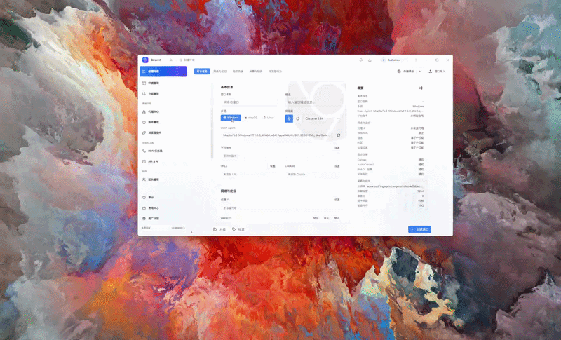

<div align="center">
  
  <h1>Simprint</h1>
  <p>面向浏览器环境、代理资源与自动化工作流的桌面工作台。</p>
  <p>
    
    
    
    
  </p>
  <table border="1" cellspacing="0" cellpadding="12">
    <tr>
      <td align="center">
        <strong>👉 立即加入 Simprint 社区</strong><br />
        <sub>获取更新、交流问题，并找到其他贡献者。</sub><br />
        <sub>👇 选择下方群组加入</sub><br /><br />
        <a href="https://t.me/simprintapp"></a>
        
      </td>
    </tr>
  </table>
  <p>
    <a href="./README.md">English</a> | <strong>简体中文</strong>
  </p>
</div>

<p align="center">
  
</p>

---

## Introduction

Simprint 是一个 local-first 的浏览器桌面工作台，用于在同一入口中集中组织浏览器配置、代理资源、自动化流程以及本地运行能力。

它适合需要长期维护多套浏览器工作环境的个人与团队，例如跨境业务、账号运营、自动化任务执行以及资源协同管理等场景。通过统一的桌面入口，Simprint 可以更稳定地管理环境生命周期、连接外部资源，并围绕日常操作建立可复用的工作流。

核心业务数据默认保存在本机，日常使用和桌面端开发均可在本地完成。

## Why Simprint?

今天大多数浏览器自动化工具和浏览器工作台产品，仍然存在一些反复出现的问题：

- 闭源，关键实现不可见，长期信任成本很高。
- 强依赖云端，把工作流和敏感数据交给第三方基础设施。
- 产品设计偏平台方而非用户方，限制环境所有权、可迁移性与控制权。
- 可扩展性很弱，难以接入自定义自动化、脚本体系和外部工具链。

Simprint 想走另一条路线：构建一个开放、可编排、可编程的浏览器工作台，服务开发者、研究者、运营团队以及重度自动化场景。目标是让浏览器环境更容易在本地掌控，更容易与周边工具集成，也更容易随着工作流逐步走向技术化和 AI 化而持续演进。

## Features

- **Isolated browser environments**：运行多套彼此隔离的浏览器工作环境，分离状态与操作边界。
- **Persistent browser profiles**：长期保存并组织浏览器配置、账号上下文与工作区状态。
- **Proxy orchestration**：在不同环境和工作流场景中接入、分配并管理代理资源。
- **Fingerprint configuration**：控制环境级浏览器特征，并持续完善指纹相关行为配置。
- **Local automation runtime**：构建和运行可重复执行的浏览器自动化工作流。
- **Chromium-based desktop runtime**：通过面向 Chromium 的本地 Tauri + Rust 桌面运行时集成前端与系统级服务。
- **Syncer**：协调多个运行中的环境，选择主控会话，并在选定窗口之间同步交互流程。
- **RPC bridge**：通过内置的 Tauri 命令桥连接 React 前端与 Rust 服务，承接桌面侧调用与编排。
- **Local API**：通过本地运行时 API 暴露环境、代理、标签、分组和浏览器内核等工作区资源。
- **MCP**：运行本地 Model Context Protocol 服务，让外部 AI 客户端接入 Simprint 管理的工具与工作区资源。

## Quick Start

完整的 Windows 从零开发配置步骤见 [开发配置文档](./docs/development-setup.zh-CN.md)。

### Prerequisites

- Node.js 20
- `pnpm` 9
- Rust toolchain
- 目标平台所需的 Tauri 系统依赖

### Run locally

```powershell
pnpm install --frozen-lockfile
cargo tauri dev
```

启动桌面端无需预先配置或运行额外服务。

## Status

Simprint 最初按照在线商业产品路线开发，目前已经迁移为 local-first 的开源桌面应用。当前开放版本将以不做功能阉割的方式提供完整的核心能力。

产品中仍可能出现部分计费界面、升级提示或商业化入口，这些早期遗留内容将在后续版本中继续整理和移除。

## Roadmap

- **AI workflows**：扩展 AI 辅助工作流与面向代理任务的执行能力。
- **Local-first hardening**：继续完善本地数据迁移、备份恢复和离线可用性。
- **Fingerprint research**：持续推进浏览器环境控制、兼容性与指纹方向研究。
- **Automation SDK**：提供更可复用的自动化构建与集成接口。

## Data Use

Simprint 的核心业务数据默认保存在用户设备上。浏览器内核下载、应用更新、代理和外部网站等需要联网的功能，仍会访问相应的第三方服务。

## Contributing

Simprint 目前正处于持续推进的开源迁移阶段，我们希望逐步吸引早期贡献者和未来的长期维护者参与进来。

具体的开发环境准备、贡献流程和 Pull Request 约定可见 [CONTRIBUTING.md](./CONTRIBUTING.md)。

当前最欢迎的贡献方向包括：

- 带有复现步骤和环境信息的 Bug 反馈
- 构建、打包与 CI 流程改进
- 文档完善、上手体验与本地开发体验优化
- 前端交互细节与工作流一致性改进
- 测试补充、回归覆盖与发布验证

欢迎提交 Issue 和 Pull Request。如果你希望长期参与维护，也欢迎通过 Issue 或 Discussion 简单介绍自己，并说明你希望参与的方向。

## Friend Links

- [LINUX DO - 新的理想型社区](https://linux.do/)

## License

本项目采用 GNU Affero General Public License v3.0 (AGPLv3) 进行许可。

如果你希望在不履行 AGPLv3 义务的前提下使用 Simprint，包括分发修改版本或以闭源服务形式提供修改版本，请联系获取商业许可。
